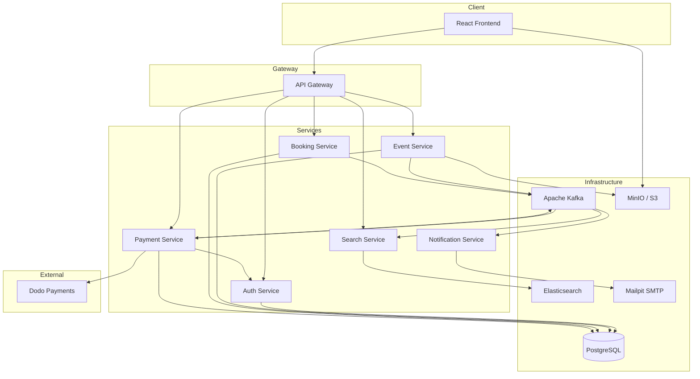
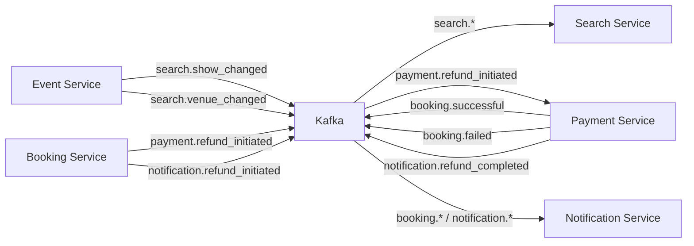

# 🎬 Ticket Show

This project started as a simple CRUD app for a college course — a basic ticket booking system with a monolithic backend. Over time, it grew into something much bigger: a fully distributed microservices platform with event-driven architecture, real-time search, payment processing, and a lot more under the hood.

If you're here to explore the codebase or set it up locally, this guide has everything you need.

---

## What Does It Do?

Ticket Show is a movie ticket booking platform where:

- **Users** can browse shows, search by city, pick seats from a live seat map, book tickets, and pay — either with a card (via Dodo Payments) or using their in-app wallet.
- **Admins** can manage shows, venues, screens, and schedules from a dedicated panel. They can upload posters, cancel shows, and deactivate venues — all of which automatically cascade to cancel affected bookings and trigger refunds.
- **Everything communicates through events** — refund processing, search indexing, and email notifications all happen through Kafka pipelines running in the background. Booking confirmation itself is synchronous (direct HTTP), but the email notifications that follow are event-driven.

---

## How It's Built

The backend is split into **7 independent services**, each with its own responsibility, talking to each other over HTTP and Kafka:



Here's what each service is responsible for:

- **API Gateway** — The single entry point for the frontend. Handles JWT authentication and proxies requests to the right service.
- **Auth Service** — User registration, login, token generation, and wallet management (balance + transaction history).
- **Event Service** — CRUD for shows, venues, screens, and schedules. Uploads posters to S3 and publishes change events to Kafka for search indexing.
- **Booking Service** — Manages the booking lifecycle. Handles seat locking (row-level DB locks to prevent double-booking), and triggers cascade cancellations when a show or venue is removed.
- **Payment Service** — Processes payments through Dodo Payments (card) or wallet. Listens for refund events on Kafka and processes them — either reversing the card charge or crediting the wallet.
- **Search Service** — Powered by Elasticsearch. Supports fuzzy full-text search across shows and venues, with real-time indexing driven by Kafka events.
- **Notification Service** — A pure Kafka consumer. Picks up booking confirmations, failures, and refund updates, then sends email notifications via SMTP.

---

## Tech Stack

| Layer | What's Used |
|-------|------------|
| Frontend | React 18, Vite, React Router |
| API Layer | FastAPI with async SQLAlchemy and Pydantic |
| Database | PostgreSQL (via `asyncpg`) |
| Messaging | Apache Kafka (via `aiokafka`) |
| Search | Elasticsearch 8.13 |
| Object Storage | MinIO (S3-compatible — stores posters) |
| Payments | Dodo Payments (checkout sessions, webhooks, refunds) |
| Email | SMTP → Mailpit (for local dev) |
| Containers | Docker Compose |

---

## Key Highlights

A few things that go beyond a typical CRUD app:

- **Seat Locking** — When you select seats, they're locked at the database level with row-level locks. No two users can book the same seat.
- **Two Payment Paths** — Card payments go through Dodo with webhook-based confirmation. Wallet payments are instant.
- **Cascade Cancellation** — Cancel a show? Every booking under it gets cancelled. Mark a venue inactive? Same thing. All affected users get refunds and email notifications automatically.
- **Event-Driven Refunds** — Booking cancellation publishes a Kafka event → Payment Service picks it up → processes the refund (Dodo reversal or wallet credit) → publishes a completion event → Notification Service sends the email. Fully async.
- **Email Notifications** — Booking confirmations, payment failures, and refund updates all trigger Kafka events that the Notification Service consumes to send emails.
- **Real-Time Search Indexing** — When an admin creates or updates a show or venue, a Kafka event updates Elasticsearch in near real-time. No stale search results.
- **S3 Poster Storage** — Posters are uploaded to MinIO (S3-compatible) and served directly to the browser. No backend proxy needed.

---

## Project Structure

```
Ticket-Show/
├── frontend/                    # React SPA (Vite)
│   ├── src/
│   │   ├── components/          # Reusable UI components
│   │   ├── pages/               # Route pages
│   │   └── assets/              # Poster images, icons
│   └── package.json
│
├── backend/
│   ├── services/
│   │   ├── api_gateway/         # Request routing + auth
│   │   ├── auth_service/        # Users, wallets, JWT
│   │   ├── event_service/       # Shows, venues, screens, schedules
│   │   ├── booking_service/     # Bookings, seat locks
│   │   ├── payment_service/     # Payments, refunds
│   │   ├── search_service/      # Elasticsearch queries + Kafka consumer
│   │   └── notification_service/# Email notifications via Kafka
│   │
│   ├── shared/                  # Shared schemas, utils, Kafka clients
│   ├── infrastructure/
│   │   ├── elasticsearch/       # ES init / seed script
│   │   ├── s3/                  # MinIO seed script
│   │   └── postgres/            # DB init
│   │
│   ├── docker-compose.dev.yml
│   └── .env
│
└── docs/
    └── user-flows.md            # Detailed flow diagrams
```

---

## Getting Started

### Prerequisites

You'll need:
- [Docker Desktop](https://www.docker.com/products/docker-desktop/) (with Compose V2)
- [Node.js](https://nodejs.org/) 18+

### 1. Clone It

```bash
git clone https://github.com/muskansindhu/Ticket-Show.git
cd Ticket-Show
```

### 2. Set Up Environment Variables

The backend ships with working defaults for local dev. Take a look at `backend/.env` and update if needed:

```env
# MinIO credentials
MINIO_ROOT_USER=minioadmin
MINIO_ROOT_PASSWORD=minioadmin

# Dodo Payments (optional — only needed if you want card payments)
DODO_PAYMENTS_API_KEY=your_key
DODO_PAYMENTS_WEBHOOK_KEY=your_webhook_key
DODO_PAYMENTS_PRODUCT_ID=your_product_id
```

### 3. Start the Backend

```bash
cd backend
docker compose -f docker-compose.dev.yml up --build
```

This spins up everything — PostgreSQL, Kafka, Elasticsearch, MinIO, all 7 services, plus two one-shot containers that seed Elasticsearch and MinIO with sample data. First boot takes a couple of minutes for image pulls.

### 4. Start the Frontend

```bash
cd frontend
npm install
npm run dev
```

### 5. Open It Up

Once everything is running:

| What | URL |
|------|-----|
| Frontend | [localhost:5173](http://localhost:5173) |
| API Docs (Swagger) | [localhost:8000/docs](http://localhost:8000/docs) |
| MinIO Console | [localhost:9001](http://localhost:9001) — login with `minioadmin` / `minioadmin` |
| Email Inbox (Mailpit) | [localhost:8025](http://localhost:8025) |

---

## Kafka Events at a Glance

Here's how the services talk to each other asynchronously:



---

## Docs

For detailed sequence diagrams of every user flow (authentication, booking, payment, cancellation, admin ops), check out:

📄 [docs/user-flows.md](docs/user-flows.md)
