# Ticket Show — User Flows

Complete map of every user flow across the microservices platform.

---

## 1. Authentication

### 1a. Register

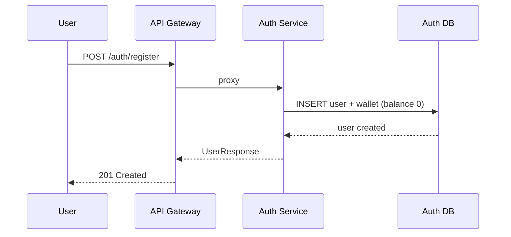

### 1b. Login

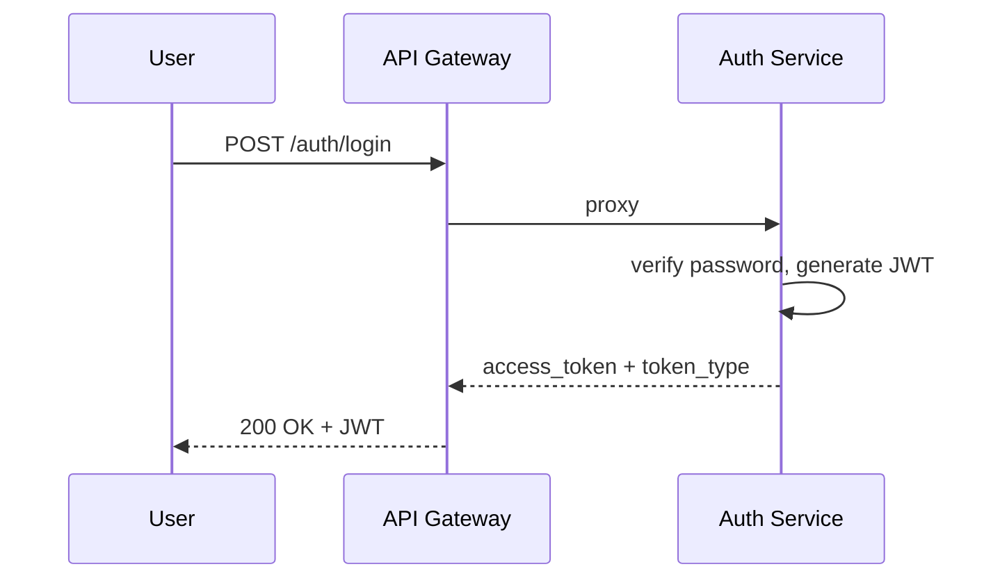

### 1c. View Profile

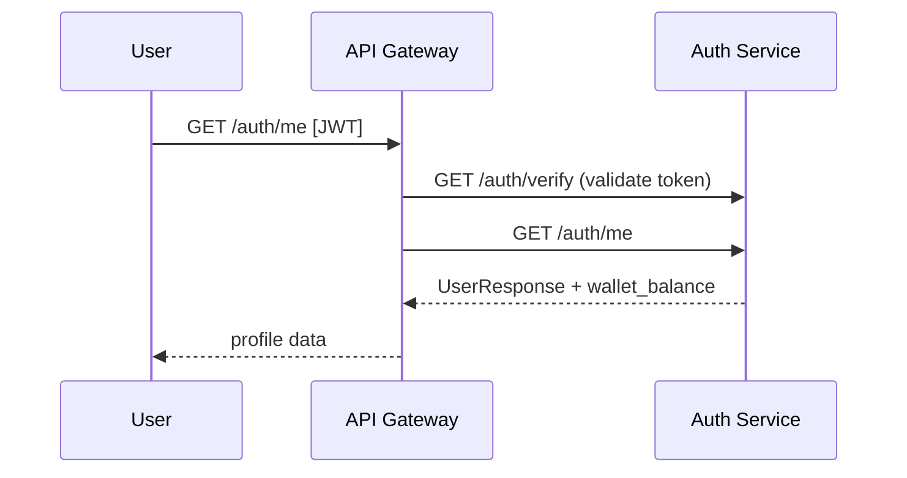

### 1d. View Wallet

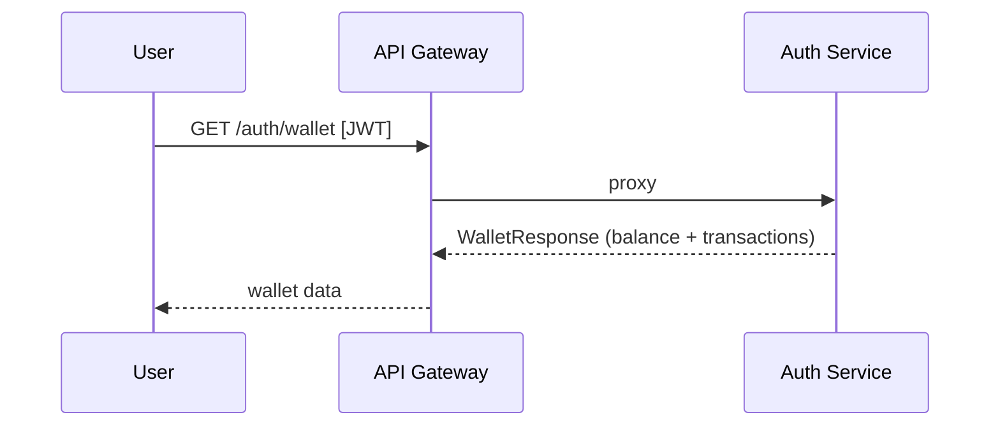

---

## 2. Browsing Shows & Venues

### 2a. Browse Dashboard (All Shows)

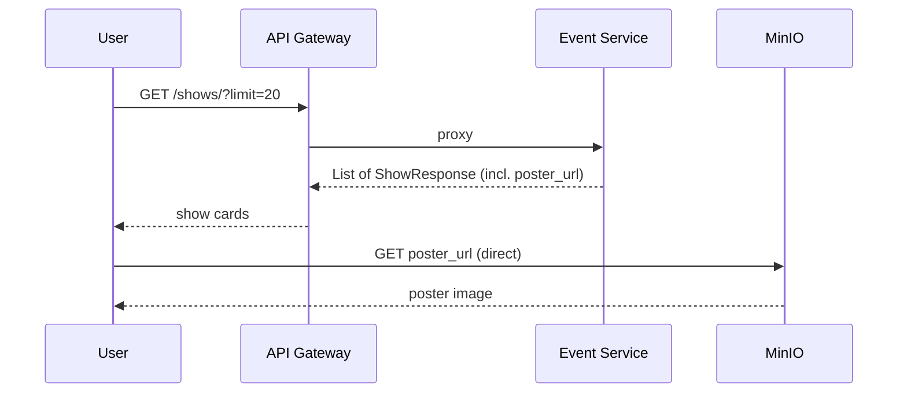

### 2b. Search Shows & Venues

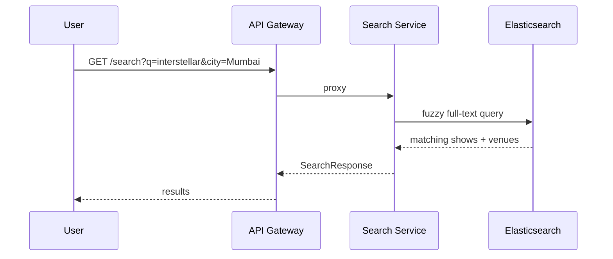

### 2c. View Show Detail + Venues + Schedules

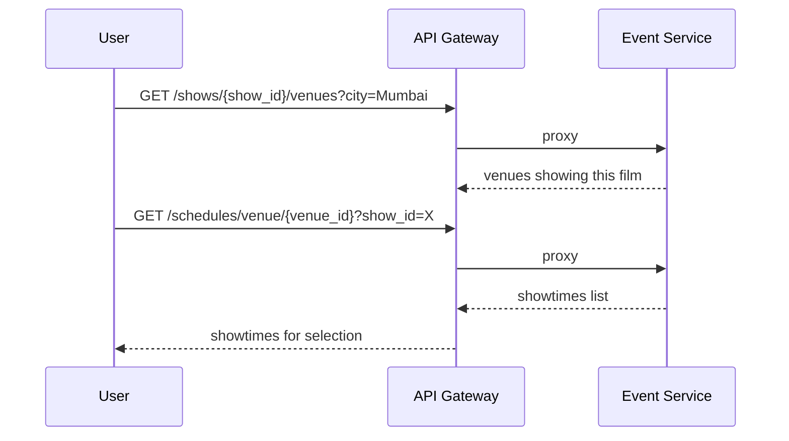

### 2d. View Available Seats

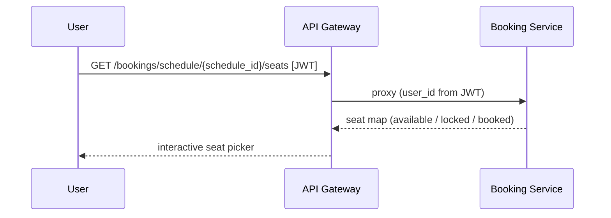

---

## 3. Booking & Payment

### 3a. Create Booking, Pay, and Confirm

This is the most complex flow spanning 4 services + Kafka.

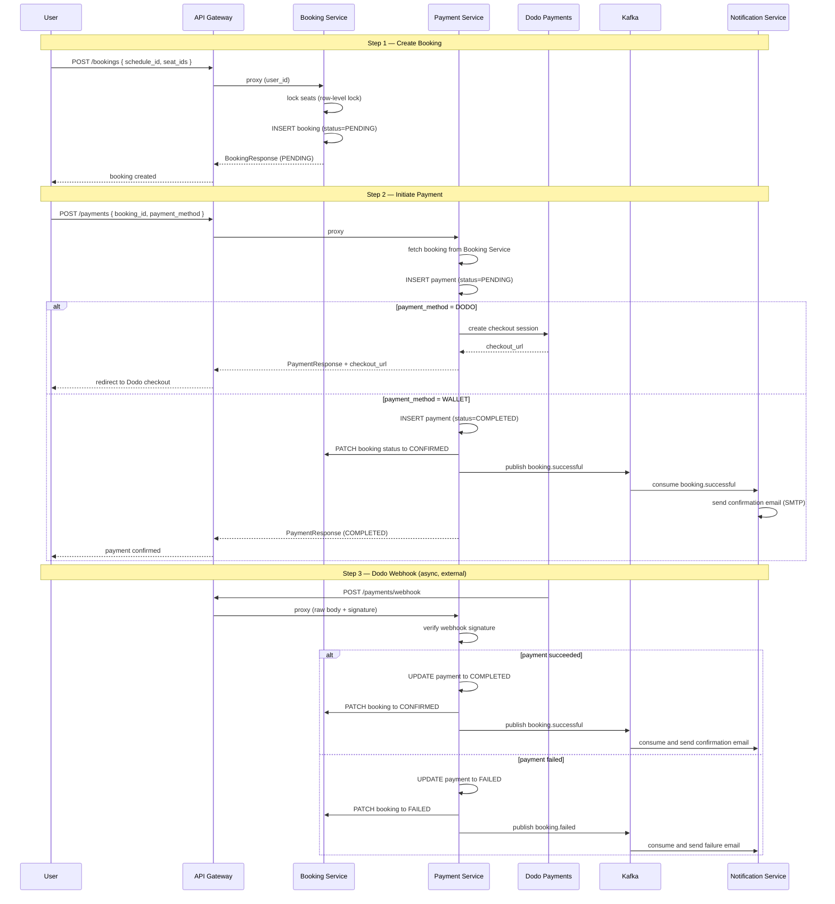

### 3b. View My Bookings

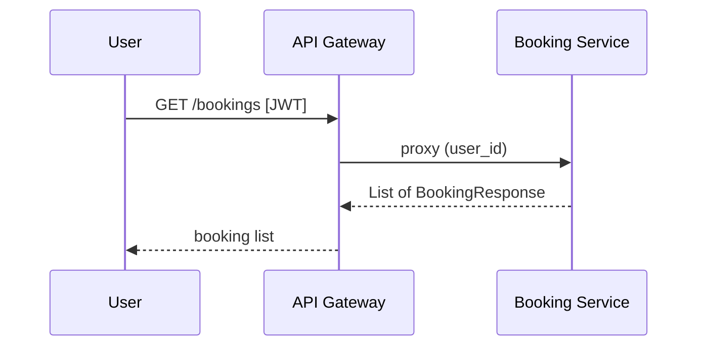

### 3c. View Booking Details + Payment

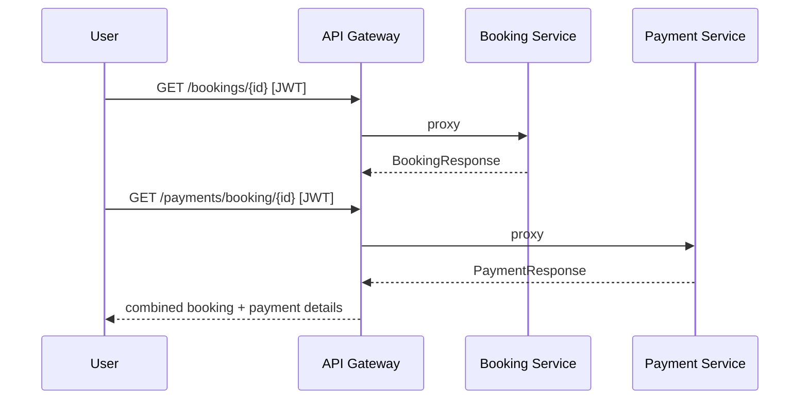

---

## 4. Cancellation & Refund

### 4a. User Cancels a Booking

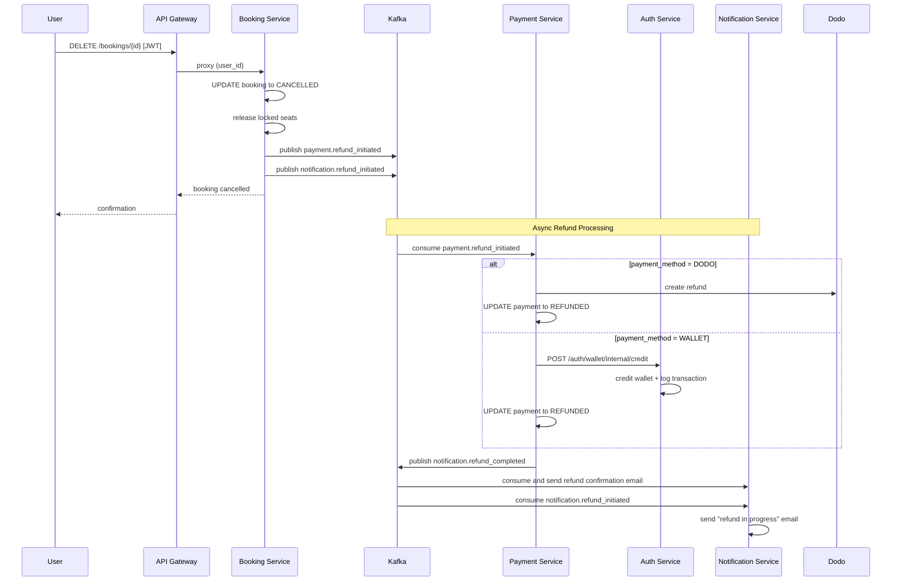

### 4b. Admin Cancels a Show (Cascade)

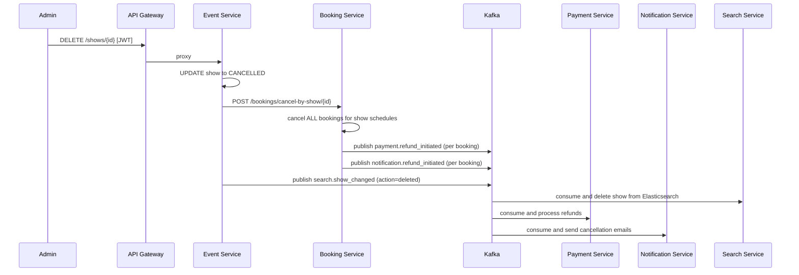

### 4c. Admin Marks Venue Inactive (Cascade)

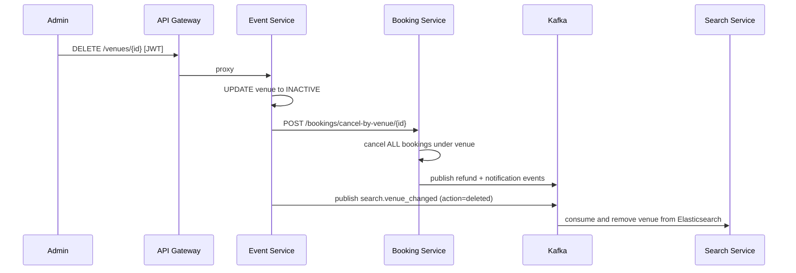

---

## 5. Admin Management

### 5a. Create Show + Upload Poster

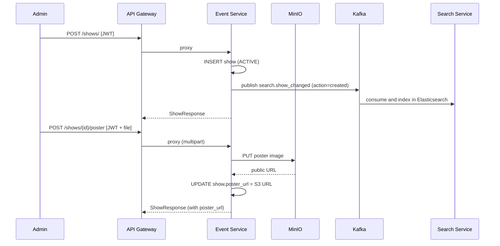

### 5b. Create Venue

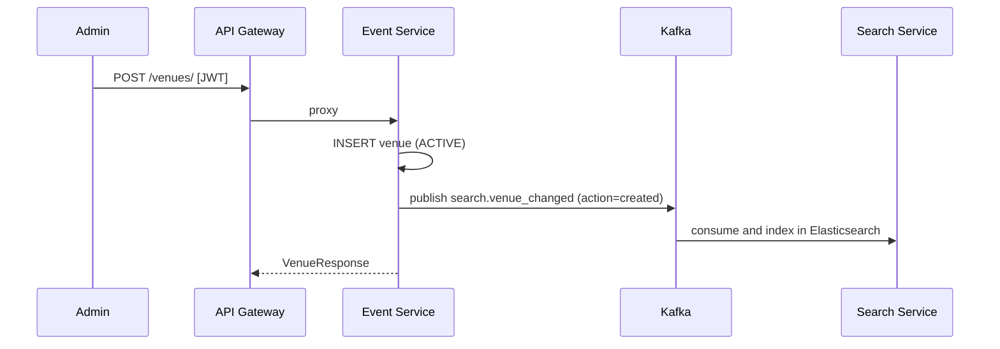

### 5c. Create Screen + Schedule

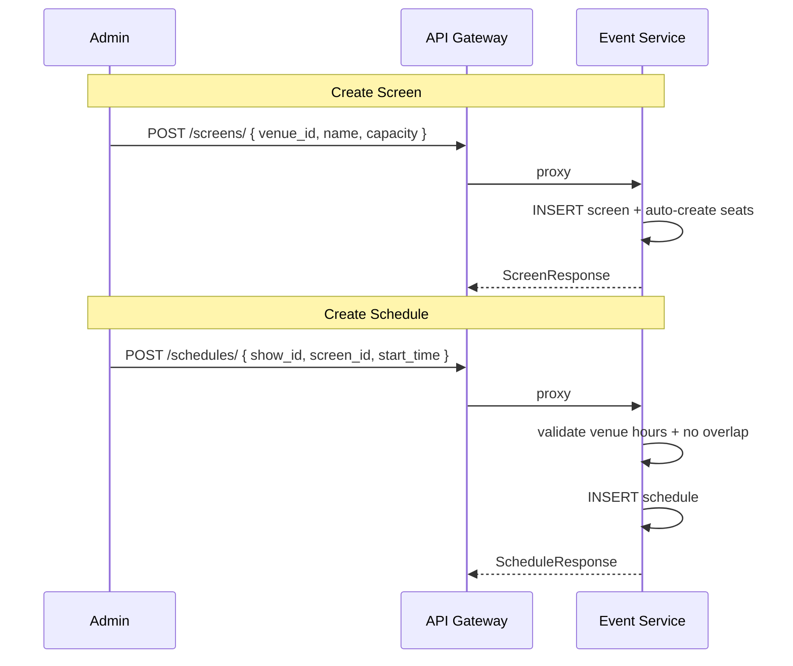

### 5d. Edit Show / Venue

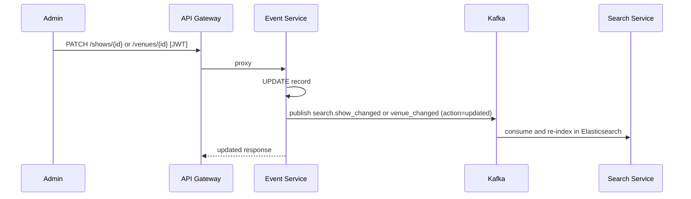

---

## 6. Infrastructure Startup (Docker Compose)

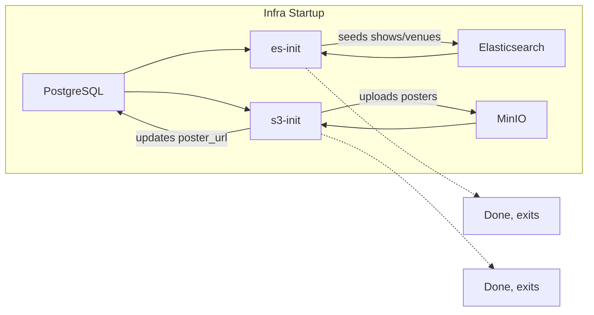

---

## Kafka Event Map

| Topic | Producer | Consumer | Purpose |
|-------|----------|----------|---------|
| `booking.successful` | Payment Service | Notification Service | Send booking confirmation email |
| `booking.failed` | Payment Service | Notification Service | Send payment failure email |
| `payment.refund_initiated` | Booking Service | Payment Service | Process refund (Dodo or wallet) |
| `notification.refund_initiated` | Booking Service | Notification Service | Send "refund in progress" email |
| `notification.refund_completed` | Payment Service | Notification Service | Send "refund completed" email |
| `search.show_changed` | Event Service | Search Service | Index/update/delete show in ES |
| `search.venue_changed` | Event Service | Search Service | Index/update/delete venue in ES |

---

## Service Communication Map

| Source | Target | Method | When |
|--------|--------|--------|------|
| API Gateway | Auth Service | HTTP | every authenticated request (token verify) |
| API Gateway | Event Service | HTTP | show/venue/screen/schedule CRUD |
| API Gateway | Booking Service | HTTP | booking CRUD + seat availability |
| API Gateway | Payment Service | HTTP | payment creation + webhook |
| API Gateway | Search Service | HTTP | search queries |
| Event Service | Booking Service | HTTP | cascade cancel (show/venue deletion) |
| Payment Service | Booking Service | HTTP | update booking status after payment |
| Payment Service | Auth Service | HTTP | credit wallet for refund |
| Payment Service | Dodo Payments | HTTP | checkout session + refund API |
| Notification Service | Mailpit (SMTP) | SMTP | send email notifications |
| Frontend | MinIO (S3) | HTTP | load poster images directly |
